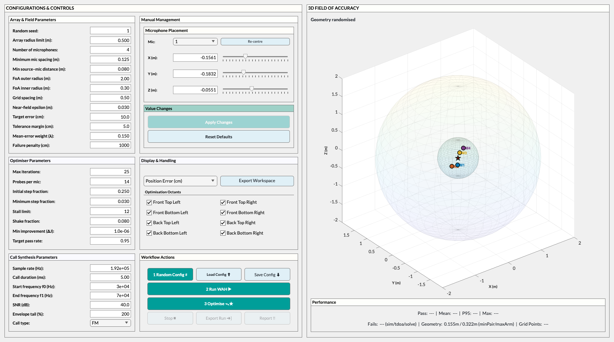

# WAH-*i* MATLAB GUI (`wahi_gui`)

This folder contains the **interactive MATLAB graphical user interface** for **WAH-*i***  

(*Widefield Acoustics Heuristic – inverse, iterative*), An array-geometry optimisation tool for designing microphone arrays with customised localisation accuracy.

The GUI provides a full end-to-end workflow for:
- Designing and editing microphone geometries
- Evaluating 3D fields of localisation accuracy
- Running the WAH and WAH-i optimisation algorithms
- Exporting optimisation runs for reproducible analysis

---

## Launching the GUI

From MATLAB, ensure the repository root (and `src/`) is on the path, then run:

```matlab
wahi_gui
```



*The WAH-i GUI at launch*