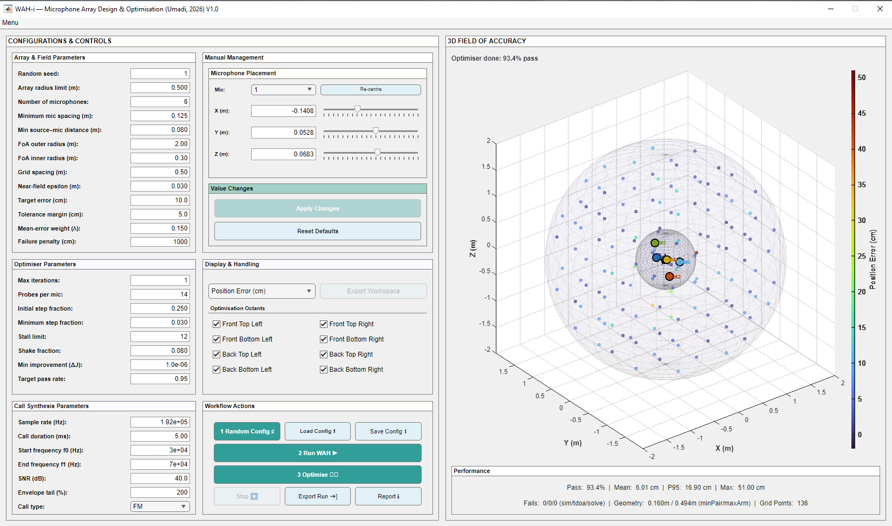
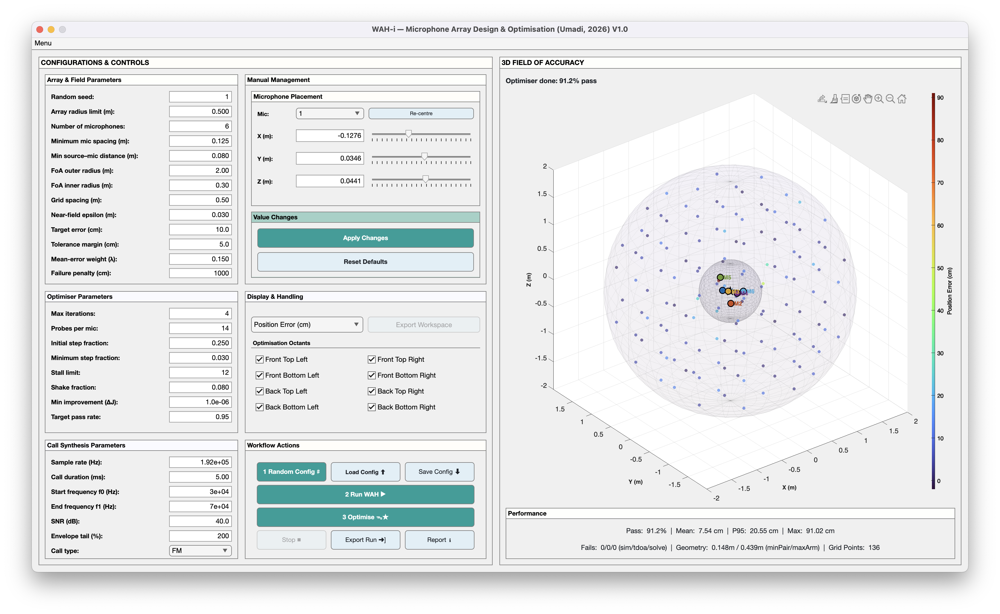

# **WAH-*i* App — Installation**

This folder contains standalone installers for the **WAH-i (Widefield Acoustics Heuristic – inverse iterative design)** MATLAB GUI.

## **Folder structure**

```
app_install/
├── winx64/   → Windows 64-bit installer
└── mac/      → macOS installer
```

## **Installation notes**

- The application is distributed as a **standalone MATLAB app**.
- **MATLAB Runtime (MCR)** is required to run the app.
- If MATLAB Runtime is **not already installed**, the installer will **automatically download and install** the appropriate version during setup.
- No full MATLAB licence is required to run the installed application.
- For the app to look its best, [install the Lato font](https://fonts.google.com/specimen/Lato) on your computer. 

## **Platform notes**

- **Windows:** Run the installer from winx64/ and follow the on-screen instructions.
- **macOS:** Run the installer from mac/. You may need to approve the app in *System Settings → Privacy & Security* on first launch.

## Installed Apps

### Windows 10 Installation



### MacOS Installation



## Reports

You may see the report of the run by clicking the `Report` button. A typical report looks like:


## Export Run

You may save the run history using the *Export Run* button, which saves the data in `.mat` file. Use `mat/iwah_singleRun_analyses.m` as a starting point for detailed analyses and possibly build your own pipeline. 

## Flexibility

The app is designed to support a wide range of optimisation strategies, recognising that multiple combinations of parameter choices, manual adjustments, and staged runs can lead to the desired accuracy within a specified field. Rather than enforcing a single workflow, WAH-*i* exposes the full set of algorithmic controls described in the accompanying research, enabling users to explore and refine solutions that best match their experimental constraints and goals. Users are encouraged to develop their own optimisation workflows and downstream analysis pipelines tailored to their specific applications.

## **Caution on Computational Load**

Localisation accuracy improves with increasing grid resolution, larger array aperture, and higher microphone counts; however, these gains come at a substantial computational cost. Finer grids, extended fields, and high-order arrays can significantly increase memory usage and processing time, particularly during optimisation runs. Users should ensure that adequate computational resources are available before attempting large-scale or high-resolution configurations.

All development and primary testing were performed on Apple M1/M2 systems. Limited testing was conducted on an Intel i5–class processor, where performance may be reduced for demanding configurations.

## Disclaimer

This software is provided **as is**, without any warranties of any kind.

All standard academic and software disclaimers apply.

Use at your own risk.